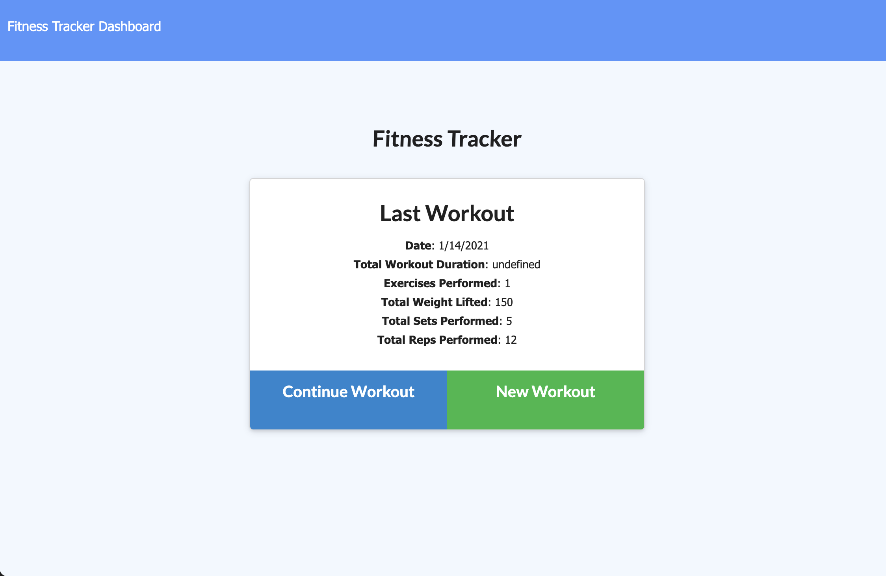
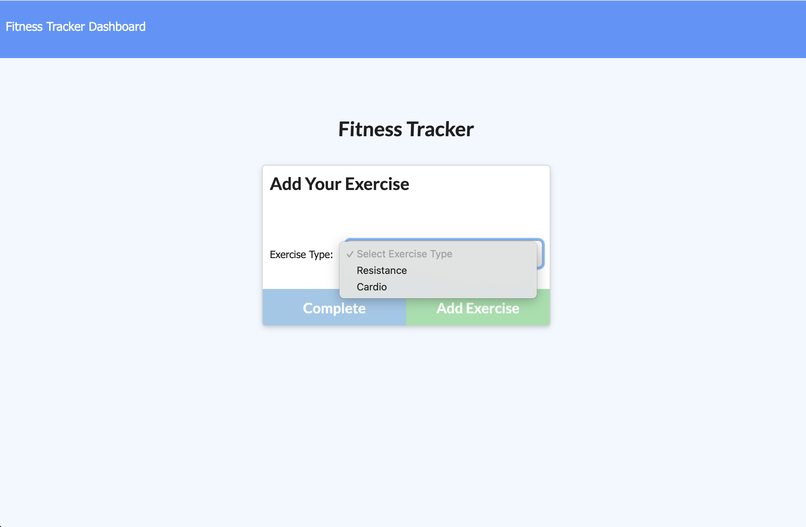
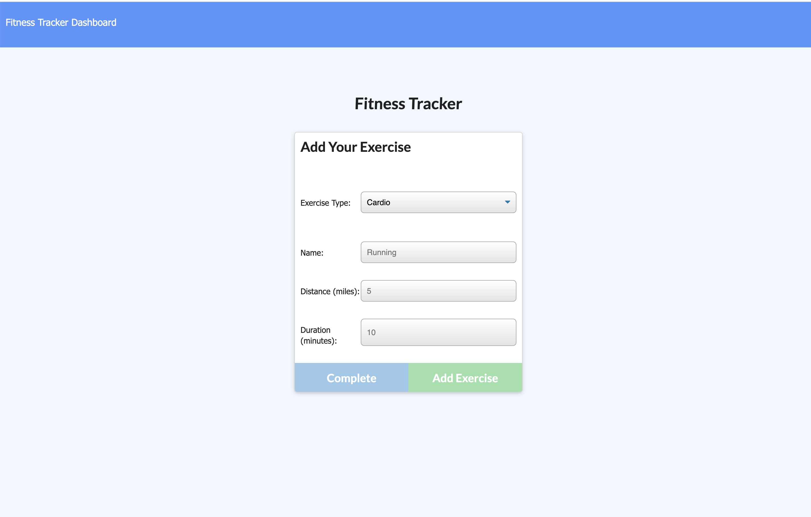
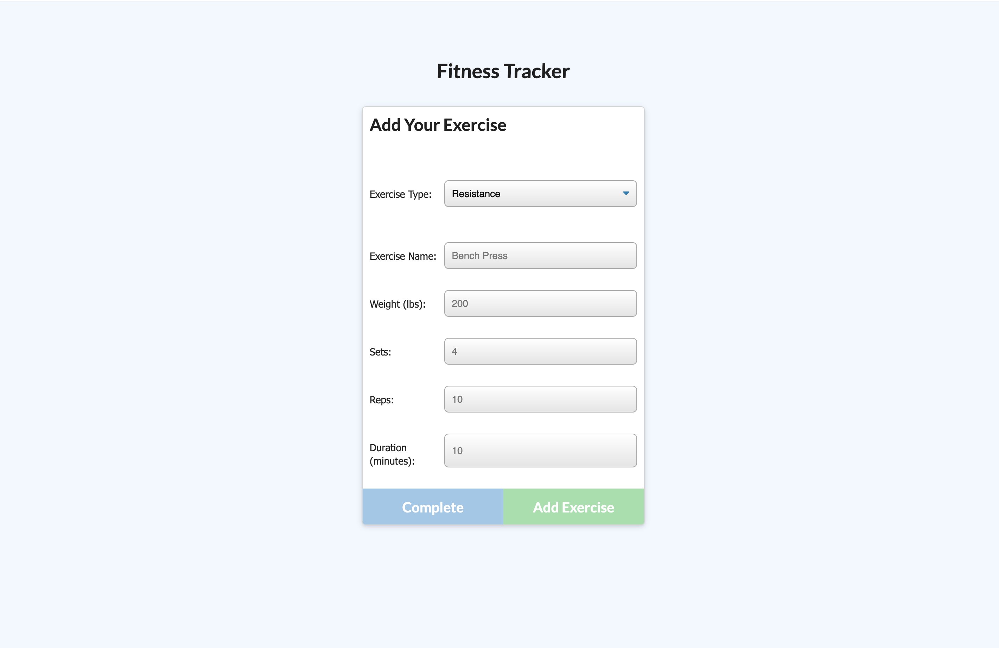
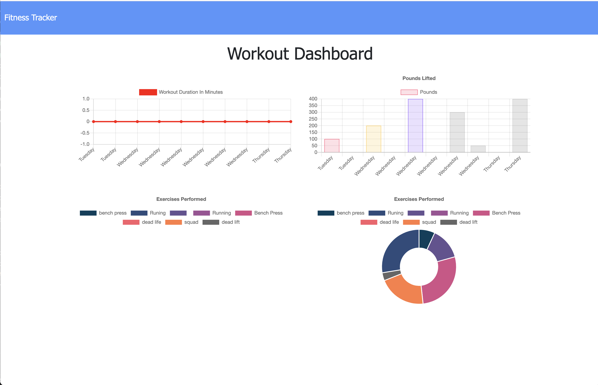

# Workout-tracker 

## Table of Content

* [Technique Usage](#Techique-Usage)
* [Description](#Description )
* [Usage Information](#Usage-Information)
* [License](#License)
* [Contributing Guildline](#Contributing-Guildline)
* [Tests Instructions](#Tests-Instructions)
* [Deployed Project](#Deployed-Project)

## Technique Usage
* Mongo database with Mongoose schema and handle routes with Express.

## Description
* This project is used for creating and tracking daily workouts. 

## Usage Information
* A user will be able to log multiple exercises in a workout on a given day also, track the name, type, weight, sets, reps and duration of exercises. If the exercise is a cardio exercise, the user will be able to track the distance traveled.

## License

## Contributing Guildeline
* I encourage public contributions.

## Tests Instructions
* When the user loads the page, the user will be given the option to create a new workout or continue with their last workout. 

 

* When the user click the buttons, the user will be giving to select the exercises type from the drop down menu; Resistance or Cardio  

 

* When the user select Resistance or Cardio, the user will be given selections and input information of the Cardio or Resistance workout. 

 

 

* When the user complete filling the information, the user will be able to see the summary of the past seven workout in the Dashboard. 

 

## Deployed Project. 
* https://frozen-eyrie-31906.herokuapp.com/
